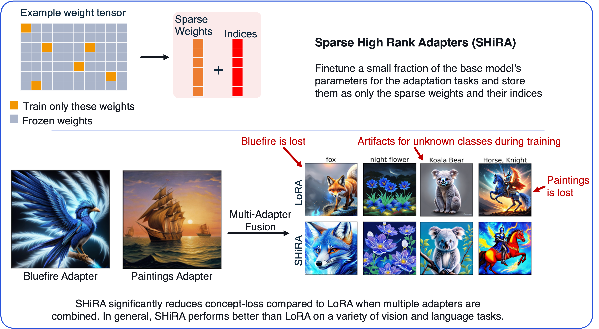

## Sparse High Rank Adapters ([NeurIPS 2024](https://proceedings.neurips.cc/paper_files/paper/2024/file/18c0102cb7f1a02c14f0929089b2e576-Paper-Conference.pdf))

Sparse High Rank Adapters or SHiRA is an alternate type of adapter and has been found to have significant advantages over the low rank adapters. Specifically, SHiRA achieves better accuracy than LoRA for a variety of vision and language tasks. It also offers simpler and higher quality multi-adapter fusion by significantly reducing concept loss, a common problem faced by low rank adapters. SHiRA directly finetunes a small number of the base model’s parameters to finetune the model on any adaptation task.

The code for SHiRA is now included in the official [PEFT Library](https://huggingface.co/docs/peft/main/en/package_reference/shira). An example to run SHiRA is present at [PEFT Github](https://github.com/huggingface/peft/tree/main/examples/shira_finetuning).



If you find our work useful, please consider citing our work:
```
@inproceedings{bhardwaj2024sparse,
  title={Sparse high rank adapters},
  author={Bhardwaj, Kartikeya and Pandey, Nilesh Prasad and Priyadarshi, Sweta and Ganapathy, Viswanath and Kadambi, Shreya and Esteves, Rafael and Borse, Shubhankar and Whatmough, Paul and Garrepalli, Risheek and Van Baalen, Mart and others},
  booktitle={Proceedings of the 38th International Conference on Neural Information Processing Systems},
  pages={13685--13715},
  year={2024}
}
```
